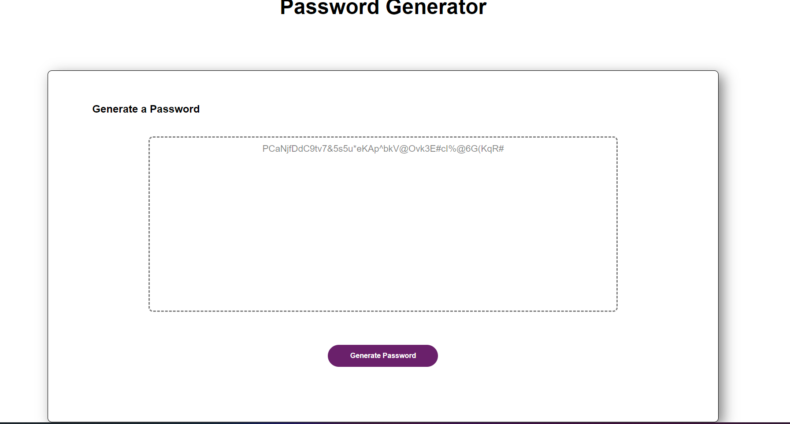

# password-generator

## Description

The password generator is meant to create a strong, unique password at the click of a button. Users can select between types of characters they want to use, as well as the length of their password

## Usage 

To use the password generator, simply click the "generate" button underneath the text field. Prompts will ask you for a length (8-128), then ask you to approve a variety of character types.
After you select your characters, your new password will be generated in the text field for you to use as you see fit. 

[https://github.com/AlexNash91/password-generator]
[https://alexnash91.github.io/password-generator/]

```md
    
    ```